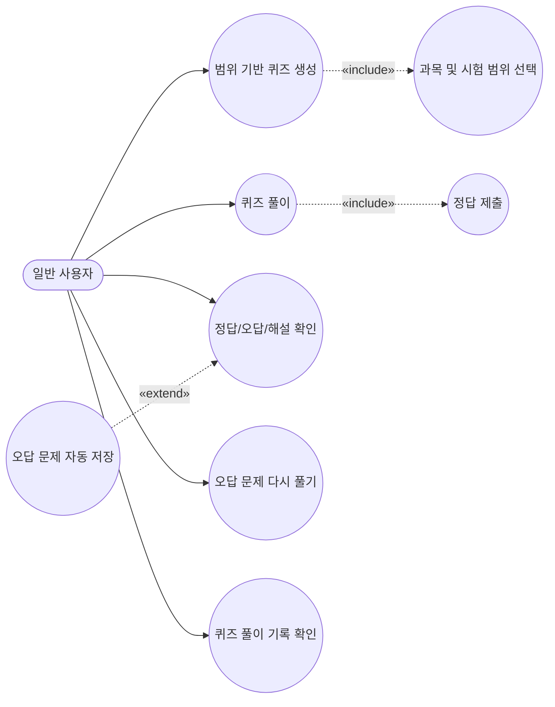
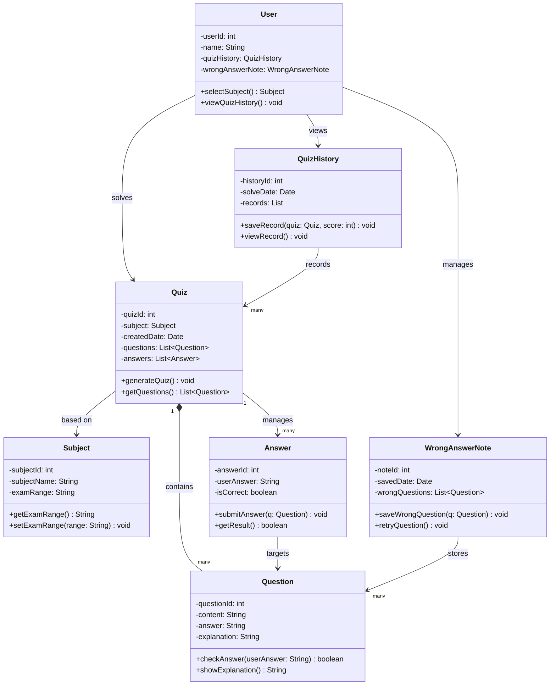
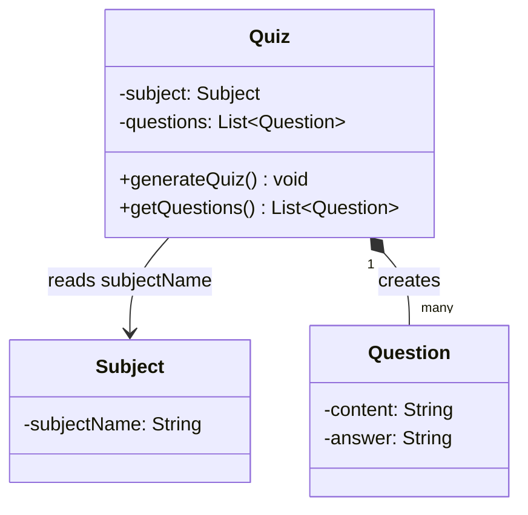

# M3 최종보고서

| 항목 | 내용 |
|---|---|
| 프로젝트명 | 단어즈 — 퀴즈기반 학습 앱 |
| 팀명 | 단어즈 |
| 과목명 | 소프트웨어개론 |
| 제출 마일스톤 | M3 최종 보고서 |
| 제출일 | 2026-06-21 |

## 팀원 목록

| 이름 | 학번 | 역할 | 주요 담당 항목 |
|---|---|---|---|
| 박인찬 | 32261823 | PM | 1·2·4·13 |
| 안병규 | 32242518 | 분석가 | 3·5 |
| 임태훈 | 32263877 | 설계자 | 7·8·9 |
| 박성주 | 32261702 | 개발자 | 6·8·11 |
| 안광우 | 32263877 | QA/보안 | 10·12 |

---

## 목차

1. 프로젝트 개요
2. 팀 구성 및 역할분담
3. 요구사항 정의서 (최종본)
4. WBS 및 프로젝트 일정 (계획 + 실적)
5. 비용 산정 결과
6. 협업 도구 운영 방식
7. UML 다이어그램 (최종본)
8. 설계 패턴 적용 내역
9. SOLID 원칙 검토
10. 인스펙션 결과 (팀 내 Cross-check)
11. 코딩 표준 문서
12. AI 활용 내역 요약
13. 회고 및 개선 사항

---

## 1. 프로젝트 개요

### 프로젝트명

단어즈 — 퀴즈기반 학습 앱

### 배경 및 문제 정의

기존의 단어 암기 방식은 단순 반복 위주로 이루어져 학습 효율이 낮고, 사용자가 어떤 단어를 자주 틀리는지 체계적으로 관리하기 어렵다는 문제가 있다. 또한 개인의 학습 수준에 맞춘 복습 기능이 부족하여 장기 기억으로 이어지지 않는 한계가 있다.

### 목적

퀴즈 생성, 오답 저장, 반복 학습 기능을 통해 사용자가 자신의 취약한 부분을 효과적으로 학습하고 자기주도적 학습 능력과 학업 성취도를 향상시킬 수 있도록 지원한다.

### 예상 사용자

단어 학습이 필요한 중·고등학생 및 자기주도 학습을 하는 일반 사용자

### 주요 기능 요약

| # | 기능명 | 설명 |
|---|---|---|
| 1 | 퀴즈 생성 | 과목 및 시험 범위를 선택하면 해당 범위의 문제를 자동 생성 |
| 2 | 답안 제출 및 채점 | 사용자가 답을 입력하면 즉시 정답 여부를 확인 |
| 3 | 정답 및 해설 확인 | 오답 시 정답과 해설 제공 |
| 4 | 오답 저장 및 복습 | 틀린 문제를 자동 저장하고 재풀이 지원 |
| 5 | 학습 기록 확인 | 퀴즈 결과(점수, 날짜)를 기록하고 조회 |

### M1 대비 변경 사항

M1 이후 변경 사항 없음. 기획 단계의 주요 기능 5가지가 구현 단계까지 동일하게 유지되었다.

---

## 2. 팀 구성 및 역할분담

| 이름 | 학번 | 역할 | 주요 담당 업무 |
|---|---|---|---|
| 박인찬 | 32261823 | PM (팀장) | 프로젝트 전체 일정 관리 및 팀원 역할 조정, 의사결정 수행, 최종보고서 통합 |
| 안병규 | 32261702 | 분석가 | 사용자 요구사항 분석 및 기능 정의, 비용 산정, 문제 해결 방향 도출 |
| 임태훈 | 32263877 | 설계자 | 시스템 구조 및 데이터 흐름 설계, UML 다이어그램, SOLID 원칙 검토 |
| 박성주 | 32261702 | 개발자 | 프로그램 기능 구현(`src/main.py`), 오류 수정, 코딩 표준 작성 |
| 안광우 | 32262515 | QA/보안 | 프로그램 테스트 및 품질 검증, 인스펙션, AI 활동 내역 요약 |

### 역할 변경 이력

역할 변경 없음

---

## 3. 요구사항 정의서 (최종본)

### 3-1. 기능 요구사항 (FR)

| ID | 요구사항 내용 | 우선순위 | 상태 |
|---|---|---|---|
| FR-01 | 사용자는 과목 및 시험 범위를 선택하여 해당 범위에 맞는 퀴즈를 생성할 수 있어야 한다. | 상 | 확정 |
| FR-02 | 사용자는 생성된 퀴즈를 풀고 정답을 제출할 수 있어야 한다. | 상 | 확정 |
| FR-03 | 사용자는 퀴즈 풀이 후 정답, 오답, 해설을 확인할 수 있어야 한다. | 중 | 확정 |
| FR-04 | 시스템은 틀린 문제를 자동 저장하고(중복 저장 방지 포함) 사용자가 다시 풀 수 있도록 지원해야 한다. | 중 | 확정 |
| FR-05 | 사용자는 점수, 날짜 등 자신의 퀴즈 풀이 기록을 확인할 수 있어야 한다. | 중 | 확정 |

### 3-2. 비기능 요구사항 (NFR)

| ID | 품질 특성 | 요구사항 내용 | 우선순위 | 상태 |
|---|---|---|---|---|
| NFR-01 | 성능 | 시스템은 퀴즈 생성 및 결과 표시를 0.5초 이내에 완료해야 한다. | 중 | 확정 |
| NFR-02 | 보안 | 시스템은 사용자 학습 데이터 및 기록을 안전하게 저장하고 인증된 사용자만 접근할 수 있도록 해야 한다. | 중 | 확정 |

### 3-3. M1 대비 변경 이력

| 버전 | 변경일 | 변경 ID | 변경 유형 | 변경 내용 | 변경 사유 |
|---|---|---|---|---|---|
| v1.0 | 2026-04-29 | — | 최초 작성 | M1 기획서 기준 | — |
| v2.0 | 2026-06-14 | FR-04 | 수정 | "중복 저장 방지" 조건 명시 추가 | 인스펙션 Cross-check에서 발견 |

---

## 4. WBS 및 프로젝트 일정 (계획 + 실적)

### 4-1. WBS

| # | 단계 | 작업 항목 | 담당자 | 산출물 | 계획 주차 | 실제 완료 주차 | 상태 |
|---|---|---|---|---|---|---|---|
| 1 | 기획 | GitHub 레포지토리 개설 및 팀원 초대 | PM | 저장소 URL | 5주 | 5주 | 완료 |
| 2 | 기획 | 요구사항 정의 | 분석가 | requirements.md | 5~6주 | 6주 | 완료 |
| 3 | 기획 | WBS 작성 및 GitHub Issues 등록 | PM·분석가 | wbs.md | 6~7주 | 7주 | 완료 |
| 4 | 기획 | 비용 산정 (간이 FP) | 분석가 | FP.md | 6~7주 | 7주 | 완료 |
| 5 | 기획 | M1 기획서 통합 | PM | docs/M1/ | 8주 | 8주 | 완료 |
| 6 | 설계 | 유스케이스 다이어그램 | 분석가 | UML 다이어그램.md | 9~10주 | 10주 | 완료 |
| 7 | 설계 | 클래스 다이어그램 | 설계자 | UML 다이어그램.md | 9~10주 | 10주 | 완료 |
| 8 | 설계 | 설계 패턴 적용 | 설계자·개발자 | 설계 패턴 적용 내역 | 11주 | 13주 | 완료 (지연) |
| 9 | 설계 | SOLID 원칙 검토 | 설계자 | SOILD 원칙 검토 | 12주 | 13주 | 완료 (지연) |
| 10 | 구현 | 핵심 로직 프로토타입 | 개발자 | src/main.py | 12~13주 | 13주 | 완료 |
| 11 | 검토 | 팀 내 Cross-check 인스펙션 | QA/보안 | Inspection.md | 13주 | 13주 | 완료 |
| 12 | 마무리 | 코딩 표준 문서 | 개발자 | 코딩 표준 문서.md | 14주 | 14주 | 완료 |
| 13 | 마무리 | AI 활동 내역 요약 | QA/보안 | AI 활동 내역 요약.md | 14주 | 14주 | 완료 |
| 14 | 마무리 | 회고 및 개선 사항 | PM | 회고 및 개선 사항.md | 14주 | 14주 | 완료 |
| 15 | 마무리 | M3 최종보고서 통합 | PM | M3_최종보고서_단어즈.md | 14주 | 14주 | 완료 |

### 4-2. 계획 vs 실적 요약

| 항목 | 계획 대비 결과 | 주요 지연 원인 |
|---|---|---|
| 전체 일정 준수율 | 약 87% | — |
| 지연 발생 작업 수 | 2건 | — |
| 주요 지연 항목 | 설계 패턴 적용 내역, SOLID 원칙 검토 (각 2주 지연) | 구현 작업 병행으로 설계 문서 작성이 후순위로 밀림. 향후에는 설계 산출물을 설계 단계 종료 즉시 작성하는 일정을 계획할 것이다. |

---

## 5. 비용 산정 결과

### 5-1. 최종 간이 FP 산정표

| 기능 유형 | 기능 목록 | 개수 | 가중치 | 소계 |
|---|---|---|---|---|
| EI (외부 입력) | 퀴즈 답안 제출(FR-02), 오답 저장(FR-04) | 2 | 3 | 6 |
| EO (외부 출력) | 퀴즈 생성(FR-01), 학습 기록 확인(FR-05) | 2 | 4 | 8 |
| EQ (외부 조회) | 정답 및 해설 단순 확인(FR-03) | 1 | 3 | 3 |
| ILF (내부 논리 파일) | 문제 DB, 사용자 학습 기록 DB, 오답 DB, 사용자 DB | 4 | 7 | 28 |
| EIF (외부 인터페이스 파일) | 외부 연동 없음 | 0 | 5 | 0 |
| **합계** | | **9** | | **45 FP** |

### 5-2. 공수 산정 결과

| 항목 | 내용 |
|---|---|
| 총 FP | 45 FP |
| 적용 생산성 | 12 FP/인월 |
| 예상 개발 기간 | 약 3.75 인월 |
| 팀 인원 기준 | 5인 기준 약 0.75개월 (약 3~4주) |

### 5-3. M1 대비 변경 사항

| 항목 | M1 산정값 | M3 최종값 | 변경 사유 |
|---|---|---|---|
| 총 FP | 45 FP | 45 FP | 요구사항 변경 없음 |
| 예상 개발 기간 | 약 3.75 인월 | 약 3.75 인월 | 변경 없음 |

---

## 6. 협업 도구 운영 방식

### 6-1. 사용 도구 목록

| 도구 | 용도 | 운영 방식 |
|---|---|---|
| GitHub | 소스코드 및 문서 버전 관리 | 각 역할 담당자가 작업 완료 시 커밋·푸시, PM이 전체 구조 관리 |
| KakaoTalk | 실시간 소통 및 일정 공유 | 팀 단체 채팅방 운영, 긴급 사항 즉시 공유 |
| Google Docs | 회의 전 안건 공유, 초안 작성 | 최종 내용은 Markdown으로 변환하여 GitHub에 업로드 |

### 6-2. 실제 운영 결과

**잘 활용된 점**: GitHub를 통해 문서 변경 이력이 자동으로 관리되어 이전 버전으로 쉽게 돌아갈 수 있었다. KakaoTalk으로 빠른 의사소통이 이루어져 일정 지연을 최소화할 수 있었다.

**운영 중 발생한 문제 및 해결 방법**: 초반에 팀원 일부가 GitHub 커밋 방식에 익숙하지 않아 파일을 웹에서 직접 업로드하는 방식을 사용했다. PM이 GitHub 가이드 문서를 공유하고 간단한 사용법을 채팅방에 정리하여 공유한 후 개선되었다.

---

## 7. UML 다이어그램 (최종본)

### 7-1. 유스케이스 다이어그램

M2 대비 변경 사항: 변경 없음

### 7-2. 클래스 다이어그램

M2 대비 변경 사항: `Quiz` 클래스에 `answers` 속성 및 `subject` 속성 명시 추가 (인스펙션 Cross-check에서 발견)

---

## 8. 설계 패턴 적용 내역

### 8-1. 적용 패턴 개요

| 항목 | 내용 |
|---|---|
| 패턴명 | Simple Factory (간이 팩토리) |
| 분류 | 생성 패턴 |
| 적용 대상 클래스 | `Quiz.generate_quiz()` |
| 선택 이유 | 과목 종류(Python, Math 등)에 따라 서로 다른 `Question` 객체 목록을 생성해야 하므로, 생성 로직을 `Quiz` 클래스 내에 집중시켜 `main()` 함수에서는 과목 분기를 알 필요 없이 `generate_quiz()` 호출만으로 문제 목록을 얻을 수 있도록 하였다. |

### 8-2. 설계자 — 패턴 적용 다이어그램

**패턴 적용 전**: `main()` 함수에서 과목별 분기 처리 및 `Question` 객체를 직접 생성해야 함.

**패턴 적용 후**: `Quiz.generate_quiz()` 메서드가 과목 이름을 기준으로 내부에서 분기 처리하여 `Question` 목록 생성. `main()`은 `quiz.generate_quiz()` 호출만 수행.

### 8-3. 개발자 — 구현 관점 적용 결과

**기술적 타당성 검토**: 현재 과목이 2개(Python, Math)인 소규모 프로젝트에서는 `if/elif` 분기가 관리 가능한 수준이다.

**구현 시 고려한 사항**: 문제 데이터가 `generate_quiz()` 내에 리스트로 일괄 구성되어 있어 새로운 문제 추가가 해당 메서드 내에서 이루어진다. 과목 수가 늘어날 경우 Factory Method 패턴으로 고도화가 필요하다.

### 8-4. QA/보안 — 품질·보안 영향 검토

문제 데이터가 소스코드에 하드코딩되어 있어 학습 목적 앱 범위에서는 문제없으나, 실제 서비스 전환 시 외부 DB 또는 암호화 파일로 분리가 필요하다. `check_answer()`의 대소문자 무시 및 공백 제거 처리는 입력 검증의 기본 요건을 충족한다.

---

## 9. SOLID 원칙 검토

### 9-1. SRP — 단일 책임 원칙

| 항목 | 내용 |
|---|---|
| 준수 여부 | 준수 |
| 적용 내용 | `User`·`Quiz`·`Question`·`Answer`·`WrongAnswerNote`·`QuizHistory` 각 클래스가 단일 책임을 갖도록 분리되었다. `QuizHistory`는 기록 저장·조회만, `WrongAnswerNote`는 오답 저장·재풀이만 담당한다. |
| 위반 내용 | `Quiz.generate_quiz()` 내에 문제 데이터와 생성 로직이 공존하는 점은 SRP 경계선에 있다. |
| 개선 방향 | `QuestionRepository` 클래스를 별도로 분리하여 문제 데이터 관리를 전담시키면 SRP를 더 엄밀하게 준수할 수 있다. |

### 9-2. OCP — 개방-폐쇄 원칙

| 항목 | 내용 |
|---|---|
| 준수 여부 | 위반 |
| 적용 내용 | 기존 클래스 구조는 변경 없이 퀴즈 기능을 제공한다는 점에서 부분적으로 OCP 의도를 따른다. |
| 위반 내용 | 새로운 과목을 추가하려면 `generate_quiz()` 메서드를 직접 수정해야 한다. |
| 개선 방향 | 과목별 서브클래스와 추상 인터페이스를 도입하면 기존 코드를 수정하지 않고 과목을 추가할 수 있다. |

### 9-3. LSP — 리스코프 치환 원칙

| 항목 | 내용 |
|---|---|
| 준수 여부 | 해당 없음 (N/A) |
| 적용 내용 | 현재 설계에서 상속 관계를 사용하지 않아 LSP를 직접 적용할 계층 구조가 없다. |
| 위반 내용 | 해당 없음 |
| 개선 방향 | 향후 과목 추상화 시 `BaseSubjectQuiz` 추상 클래스를 도입한다면 서브클래스가 부모를 완전히 대체할 수 있도록 인터페이스를 설계해야 한다. |

---

## 10. 인스펙션 결과 (팀 내 Cross-check)

### 10-1. 검토 개요

| 항목 | 내용 |
|---|---|
| 검토 일시 | 2026-06-14 (13주차) |
| 검토 방식 | 팀 내 역할 교환 (분석가↔개발자, 설계자↔QA/보안) |
| 검토 산출물 | `src/main.py`, `docs/M2/UML 다이어그램.md`, `docs/M1/requirements.md` |
| 검토 참여 인원 | 5명 (전원 참여) |

### 10-2. 역할별 교차 검토 결과

| 검토 방향 | 검토자 | 검토 항목 | 발견된 결함 | 심각도 | 수정 여부 |
|---|---|---|---|---|---|
| 분석가 산출물 → 개발자 | 박성주 | requirements.md | FR-04 오답 저장에 중복 저장 방지 조건 미명시 | 하 | 수정 |
| 설계자 산출물 → QA/보안 | 안광우 | UML 다이어그램.md | `Quiz` 클래스 `answers` 속성 누락 | 중 | 수정 |
| 개발자 산출물 → 분석가 | 안병규 | src/main.py | `generate_quiz()` 하드코딩으로 OCP 위반 가능성 | 중 | 부분 수정 |
| QA/보안 산출물 → 설계자 | 임태훈 | SOLID 원칙 검토 | LSP 항목 설명 부족 | 하 | 수정 |

### 10-3. 검토 결과 반영 요약

| # | 검토 항목 | 지적 내용 | 반영 여부 | 비고 |
|---|---|---|---|---|
| 1 | FR-04 오답 저장 조건 | 중복 저장 방지 조건 미명시 | 반영 | 코드에서 `if question not in self.wrong_questions` 조건으로 구현 |
| 2 | 클래스 다이어그램 속성 누락 | `Quiz.answers` 누락 | 반영 | UML 다이어그램 최종본 업데이트 |
| 3 | `generate_quiz()` 하드코딩 | OCP 위반 가능성 | 부분 반영 | 프로젝트 범위 한계로 구조 유지, SOLID 문서에 개선 방향 기록 |
| 4 | LSP 항목 설명 부족 | 이유 미기술 | 반영 | SOLID 검토 문서 내 설명 보완 |

---

## 11. 코딩 표준 문서

적용 언어: Python 3.x

| 항목 | 적용 기준 |
|---|---|
| 명명 규칙 — 클래스 | PascalCase (예: `QuizHistory`, `WrongAnswerNote`) |
| 명명 규칙 — 메서드·함수 | snake_case (예: `generate_quiz`, `check_answer`) |
| 명명 규칙 — 변수 | snake_case (예: `user_answer`, `quiz_id`) |
| 명명 규칙 — 상수 | UPPER_SNAKE_CASE (예: `MAX_QUESTIONS`) |
| 들여쓰기 | 스페이스 4칸 (탭 사용 금지) |
| 줄 길이 | 최대 100자 권장 |
| 문자열 | 큰따옴표(`"`) 통일 사용 |
| 주석 규칙 | 한국어 한 줄 주석 `#` 사용, 메서드 상단에 기능 설명 작성 |
| 파일 구조 | 클래스별 구분선(`# --- ClassName ---`) 사용 |
| 빈 줄 | 클래스 정의 사이에 2줄 빈 줄, 메서드 사이에 1줄 빈 줄 |
| AI 생성 코드 표기 | AI가 생성한 코드 블록 상단에 `# AI-generated` 주석 추가 |
| 기타 | 입력값 앞뒤 공백은 `strip()` 처리, 불필요한 `else` 절 최소화 |

---

## 12. AI 활용 내역 요약

### 12-1. 팀 전체 AI 활용 현황

| 항목 | 내용 |
|---|---|
| 주요 사용 도구 | ChatGPT(GPT-4), Claude, Gemini |
| 가장 많이 활용한 단계 | 구현 단계 (M3) |

### 12-2. 단계별 활용 내역

| 단계 | 주요 활용 내용 | 활용 도구 | 팀 수정 여부 |
|---|---|---|---|
| 기획 (M1) | 요구사항 정의서 초안, WBS 작성 참고, 누락 항목 점검 | ChatGPT, Claude | 수정 (우선순위·비기능 요구사항 팀이 직접 조정) |
| 설계 (M2) | 유스케이스·클래스 다이어그램 초안 생성, Mermaid 문법 확인 | Claude, Gemini | 수정 (클래스 속성·관계 팀이 검토 및 수정) |
| 구현·검토 (M3) | `main.py` 클래스 구조 참고, 오류 수정, 코딩 표준 초안, 인스펙션 체크리스트 | ChatGPT, Claude | 수정 (중복 저장 방지 로직, 대소문자 처리 등 팀이 수정) |

### 12-3. AI 활용 3원칙 준수 자체 평가

| 원칙 | 준수 여부 | 비고 |
|---|---|---|
| 단순 복사 금지 | 준수 | AI 결과물을 그대로 사용한 경우 없음 |
| 비판적 검증 | 준수 | AI가 생성한 다이어그램 오류를 인스펙션을 통해 발견·수정 |
| 수정 이력 명시 | 준수 | 팀원 각자 개인 AI 로그에 기록 |

### 12-4. 가장 효과적이었던 AI 활용 사례

`src/main.py`의 초기 클래스 구조 설계 단계에서 Claude에게 클래스 다이어그램을 Python 코드로 변환하는 작업을 요청했다. AI가 생성한 초안을 바탕으로 팀이 `WrongAnswerNote`의 중복 저장 방지 조건과 `check_answer()`의 대소문자 무시·공백 제거 처리를 보완하여 품질을 높였다.

### 12-5. AI 활용의 한계 또는 주의가 필요했던 사례

Gemini가 생성한 Mermaid 클래스 다이어그램 코드에서 관계 표기 문법 오류(`*--` 방향 혼동)가 발생하여 GitHub에서 렌더링이 되지 않았다. AI가 생성한 코드는 반드시 GitHub에서 실제 렌더링을 확인하는 검증 단계를 거쳐야 한다는 것을 학습했다.

---

## 13. 회고 및 개선 사항

### 13-1. 팀 전체 회고

**잘된 점**: 역할이 명확하게 분리되어 중복 작업 없이 진행되었다. GitHub를 통한 문서 관리로 변경 이력 추적과 팀원 간 파일 공유가 원활했다. M1의 클래스 다이어그램이 `src/main.py` 구현 시 그대로 활용되어 설계와 구현의 일관성이 유지되었다.

**아쉬운 점**: 설계 패턴·SOLID 검토 문서가 늦게 작성되어 M3 단계에서 일괄 보완이 필요했다. 회의록 작성이 불규칙하여 의사결정 이력이 충분히 남지 않았다. `generate_quiz()` OCP 위반 구조를 이번 학기 내에 개선하지 못했다.

**배운 점**: 요구사항 정의서를 명확히 작성해두면 이후 설계·구현 단계에서 방향을 잃지 않는다는 것을 경험했다. 팀 내 Cross-check를 통해 개인이 놓친 오류를 서로 발견할 수 있었고, AI 결과물은 반드시 실제 동작 검증이 필요하다는 것을 확인했다.

**다음에 다시 한다면**: 주차별 회의록을 꾸준히 작성하고, 각 단계 완료 즉시 문서화하며, 초기 설계에서 확장성을 고려한 패턴을 채택할 것이다.

### 13-2. 팀원별 소감

| 이름 | 역할 | 한 줄 소감 |
|---|---|---|
| 박인찬 | PM | 전체 일정을 관리하며 팀원 역할 조율의 중요성을 실감했고, 문서 관리 체계가 프로젝트 품질에 직접 연결된다는 것을 배웠다. |
| 안병규 | 분석가 | 요구사항을 명확히 정의하는 작업이 이후 모든 단계의 기준이 된다는 것을 이번 프로젝트를 통해 체감했다. |
| 임태훈 | 설계자 | 클래스 다이어그램을 실제 구현 가능한 수준으로 설계하는 과정이 어렵고도 중요하다는 것을 알았다. |
| 박성주 | 개발자 | 설계 문서를 기반으로 코드를 작성하니 방향이 명확했고, 인스펙션을 통해 팀이 함께 놓친 부분을 잡아준 것이 도움이 되었다. |
| 안광우 | QA/보안 | Cross-check를 통해 산출물을 객관적으로 보는 시각을 키웠고, AI 결과물 검증의 필요성을 직접 경험했다. |

---

*최종 수정: 2026-06-21 | 담당: 박인찬 (PM) | 단어즈 팀*
