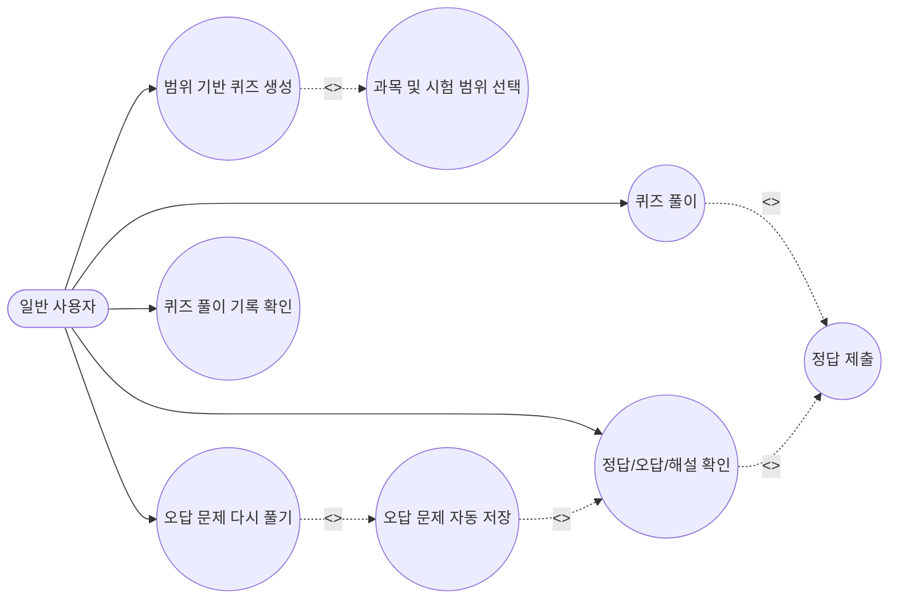

Use Cases :
1. 

요구사항 정의서
기능 요구사항 (Functional Requirements)
기능 ID	주요 기능	설명	우선순위
FR-01	퀴즈 생성 기능	사용자는 과목 및 시험 범위를 선택하여 해당 범위에 맞는 퀴즈를 생성할 수 있어야 한다.	상
FR-02	퀴즈 풀이 및 답안 제출	사용자는 생성된 퀴즈를 풀고 정답을 제출할 수 있어야 한다.	상
FR-03	정답 및 해설 확인	사용자는 퀴즈 풀이 후 정답, 오답, 해설을 확인할 수 있어야 한다.	중
FR-04	오답 저장 및 복습	시스템은 틀린 문제를 자동 저장하고 사용자가 다시 풀 수 있도록 지원해야 한다.	중
FR-05	학습 기록 확인	사용자는 점수, 정답률 등 자신의 퀴즈 풀이 기록을 확인할 수 있어야 한다.	중
비기능 요구사항 (Non-Functional Requirements)
기능 ID	주요 기능	설명	우선순위
NFR-01	성능	시스템은 퀴즈 생성 및 결과 표시를 0.5초 이내에 완료해야 한다.	중
NFR-02	보안	시스템은 사용자 학습 데이터 및 기록을 안전하게 저장하고 인증된 사용자만 접근할 수 있도록 해야 한다.	중

----

