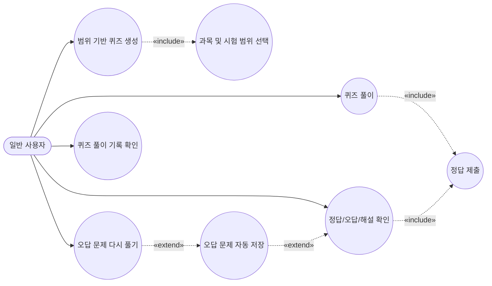
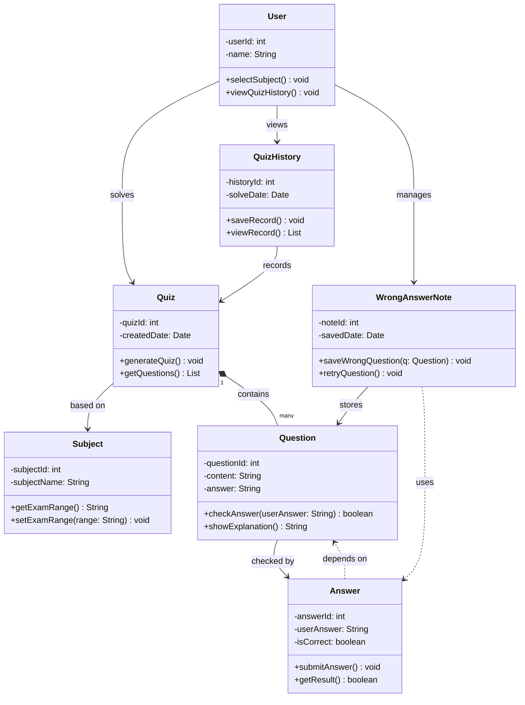

# 유스케이스 다이어그램 

---
# 클래스 다이어그램

아래는 시험 범위 기반 퀴즈 시스템의 유스케이스를 기반으로 작성한 클래스 다이어그램이다.

---

## 클래스 설명

| 클래스 | 설명 |
|---|---|
| User | 퀴즈를 생성하고 풀이하는 일반 사용자 |
| Subject | 과목 및 시험 범위 정보를 관리 |
| Quiz | 범위 기반으로 생성된 퀴즈 |
| Question | 퀴즈에 포함되는 개별 문제 |
| Answer | 사용자의 답안 제출 및 채점 결과 |
| WrongAnswerNote | 오답 문제 저장 및 재풀이 기능 |
| QuizHistory | 사용자의 퀴즈 풀이 기록 관리 |

---

## 주요 기능

- 과목 및 시험 범위 선택
- 범위 기반 퀴즈 자동 생성
- 문제 풀이 및 정답 제출
- 정답/오답/해설 확인
- 오답 자동 저장
- 오답 다시 풀기
- 퀴즈 풀이 기록 조회
