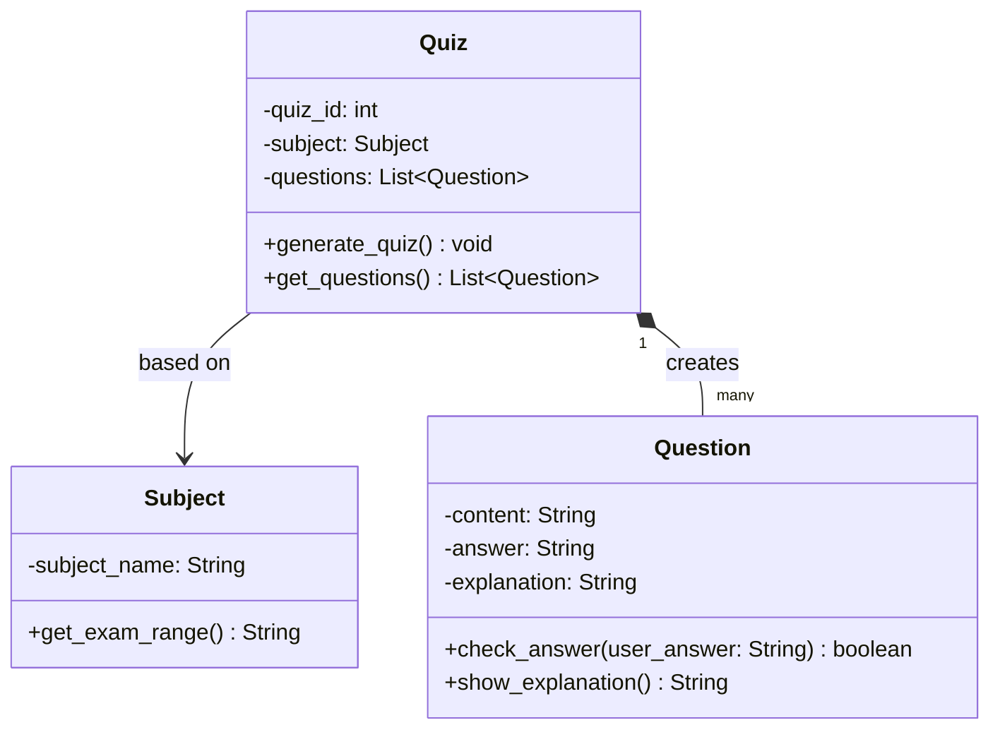

# 설계 패턴 적용 내역

> 단어즈 팀 | 소프트웨어개론 | 2026년 1학기

---

## 1. 적용 패턴 개요

| 항목 | 내용 |
|---|---|
| 패턴명 | Simple Factory (간이 팩토리) |
| 분류 | 생성 패턴 |
| 적용 대상 클래스 | `Quiz.generate_quiz()` |
| 선택 이유 | 과목 종류(Python, Math 등)에 따라 서로 다른 `Question` 객체 목록을 생성해야 하므로, 생성 로직을 한 곳에서 관리하는 팩토리 방식을 적용했다. 이를 통해 퀴즈를 사용하는 측(`main()`)에서는 어떤 과목인지 모르더라도 `generate_quiz()`만 호출하면 된다. |

---

## 2. 패턴 적용 설명

### 적용 전

`main()` 함수에서 과목 분기와 문제 생성을 직접 처리해야 하며, 새로운 과목 추가 시 `main()` 수정이 필요하다.

### 적용 후

`Quiz.generate_quiz()` 메서드가 과목 이름을 기준으로 해당 과목의 `Question` 목록을 생성하여 반환한다. `main()` 함수는 `quiz.generate_quiz()` 호출만 하면 되고, 내부 분기는 `Quiz` 클래스가 담당한다.

```python
# main()에서는 과목 정보와 무관하게 동일한 방식으로 퀴즈 생성
quiz = Quiz(1, subject)
quiz.generate_quiz()  # 내부적으로 과목별 분기 처리
questions = quiz.get_questions()
```

---

## 3. 클래스 다이어그램 (패턴 적용 후)



---

## 4. 기술적 타당성 검토 (개발자 관점)

- `generate_quiz()` 내부의 `if/elif` 분기는 현재 과목이 2개(Python, Math)인 소규모 프로젝트 범위에서는 관리 가능한 수준이다.
- 과목 수가 5개 이상으로 늘어날 경우, 각 과목별 클래스를 분리하고 Factory Method 패턴으로 고도화하는 것이 권장된다.
- 현재 구현에서 `Question` 객체 생성은 `generate_quiz()` 내에서 리스트로 일괄 처리하며, 추가 의존성 없이 단순하게 동작한다.

---

## 5. 품질·보안 영향 검토 (QA/보안 관점)

- 문제 데이터가 소스코드 내에 하드코딩되어 있어, 문제 유출 위험이 없는 학습 목적 앱에서는 문제없다.
- 실제 서비스 전환 시 문제 데이터를 외부 DB 또는 암호화된 파일로 분리해야 보안이 확보된다.
- `check_answer()` 메서드는 대소문자 무시 및 앞뒤 공백 제거를 처리하여 입력값 검증의 기본 수준을 충족한다.

---

*작성일: 2026-06-21 | 담당: 임태훈(설계자)·박성주(개발자) 공동, 검토: 안광우(QA/보안)*

